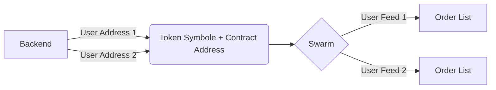
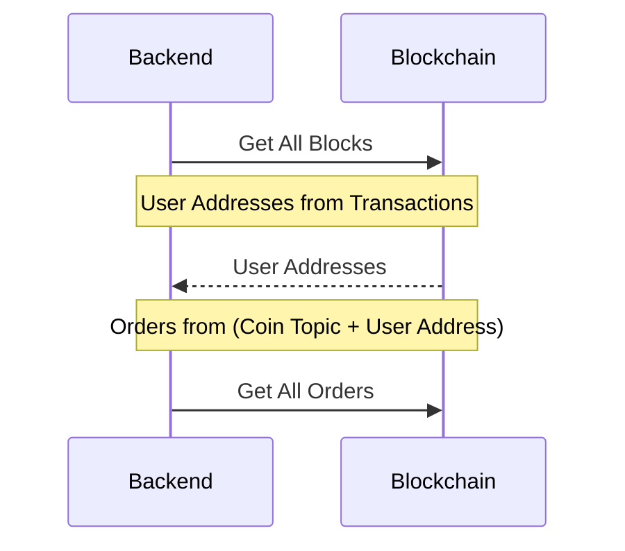

## Orderbook flow

## Crawler flow

## Swarm usage

1. Only Feed storage and message queue is enable (no file upload to spam)
1. Only User has coin can order, and update his own orders
1. A user can only attemp a fix number of orders, and update an order in a specific amount of time base on timestamp of each order
1. Each topic is a coin symbol, so the total of topics is limited
1. First time new node needs to crawl orders to catchup, then subscribes to the order channel for realtime update

## How to start

By default we use POA consensus for demo  
Node1: `go run protocol/OrderBook/*.go start -privateKey keystore1 -mining true`  
Node2: `go run protocol/OrderBook/*.go start -p2pPort=30101 -httpPort=8546 -wsPort=18544 -bzzPort=8543 -privateKey keystore2`
Backend: `go run protocol/Backend/*.go rpc`

## TODO

1. Move swarm to a new package named ethereum-swarm and use tomochain as the original go-ethereum.
2. Optimize swarm to make it fit better with the running version
3. Wrap all orderbook APIs using rpcClient into orderbookClient
