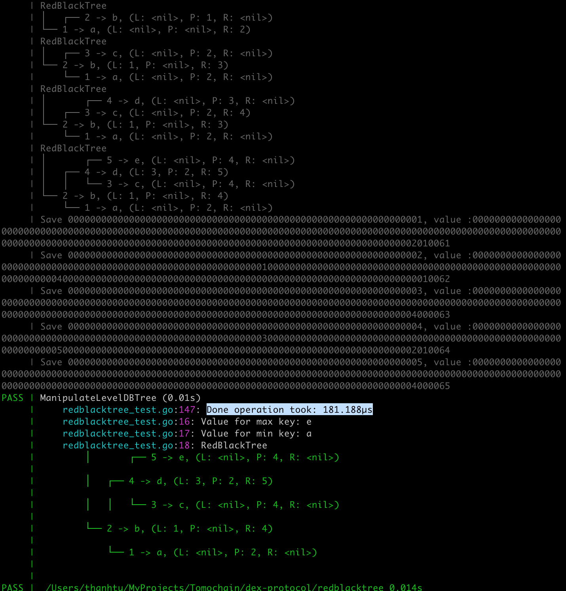

## Red Black Tree using LevelDB as storage

### Save key-value to Red Black Tree



```go
datadir := "../datadir/ethereum/orderbook"
obdb, _ := ethdb.NewLDBDatabase(datadir, 0, 0)

tree := &RedBlackTreeExtended{NewWithBytesComparator(RLPEncodeToBytes, RLPDecodeBytes, obdb)}

tree.Put([]byte("1"), []byte("a")) // 1->a (in order)
tree.Put([]byte("2"), []byte("b")) // 1->a, 2->b (in order)
tree.Put([]byte("3"), []byte("c")) // 1->a, 2->b, 3->c (in order)
tree.Put([]byte("4"), []byte("d")) // 1->a, 2->b, 3->c, 4->d (in order)
tree.Put([]byte("5"), []byte("e")) // 1->a, 2->b, 3->c, 4->d, 5->e (in order)

print(tree, t)
// Value for max key: e
// Value for min key: a
// RedBlackTree
// │       ┌── 5
// │   ┌── 4
// │   │   └── 3
// └── 2
//     └── 1

// tree.RemoveMin() // 2->b, 3->c, 4->d, 5->e (in order)
// tree.RemoveMax() // 2->b, 3->c, 4->d (in order)
// tree.RemoveMin() // 3->c, 4->d (in order)
// tree.RemoveMax() // 3->c (in order)

// print(&tree, t)
// Value for max key: c
// Value for min key: c
// RedBlackTree
// └── 3
```

### Using Red Black Tree to search for max-min value

```go
datadir := "../datadir/ethereum/orderbook"
obdb, _ := ethdb.NewLDBDatabase(datadir, 0, 0)

tree := &RedBlackTreeExtended{NewWithBytesComparator(RLPEncodeToBytes, RLPDecodeBytes, obdb)}
tree.SetRoot([]byte("2"))

print(tree, t)
```
