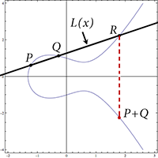
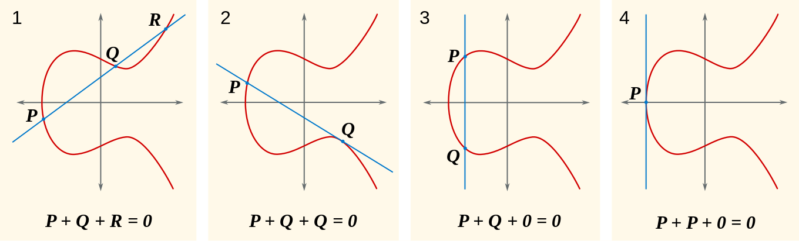
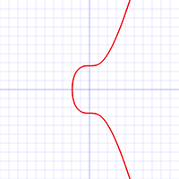

# Zero knowledge proof using elliptic-curves-finite-fields

The Python code to demonstrate zero-knowledge atomic cross-blockchain swap

## connect elliptic curves with finite fields

let's assume we have a function gcd(a,b), gcd: greatest common dividor between a and b
and a finite field over p, p is prime  
because nx + py = gcd(n, p), using extend euclidean we have (x,y,d), d = 1 because p is prime  
Example:
suppose we have _F23_ is integers over prime _p = 23_  
with _n = 7_, we have _F23(7) = 7 mod 23_  
_x = F23(7).inverse() = 10 mod 23_  
_xn = 70 mod 23 = 1_, so _x = n-1_ which means we can say x*n*m = m  

suppose we have irreducible or prime polynomial:
y2 = x3 + x + 1 with coefficients over the finite field of order 25  
y = L(x) connecting P, Q that on the curve  
replace in the L(x)2 = x3 + x + 1
to prove this has algebraic structures we need to convert it into homogeneous degree three equation:y2z = x3 + xz2 + z3  
so we have [0:1:0] to be our zero point, which serves as the identity of the group, and we can test group law:

1. We need there to be an the additive identity, which we’ll call zero, for which P + 0 = 0 + P = P. This is [0:1:0], we call it point O.
2. We need every point P to have an inverse -P for which P + (-P) = 0. Look at the picture above, if we have Q, P on the curve, we can describe a third point P+Q to be -R, the point opposites R.
3. We want adding to commute, so that P + Q = Q + P. This property of an algebraic structure is called abelian or commutative.
   - If one of the points is O, then P + O = P = O + P.
   - If P and O are opposites of each other, then P + Q = Q + P = O.
   - If P = Q then we use tangent line to the curve at this point as our line, then we also have R and -R. If P is an inflection point then R is P itself.
4. We need addition to be associative, so that (P + Q) + R = P + (Q + R). Two points form a vertical line so it is taken care.

Let k be a field and let E be the equation of an elliptic curve in Weierstrass form. Define E(k) to be a set of projective points on E with coordinates in k along with the ideal point [0:1:0]. We call E(k) the elliptic curve group for E over k.

## digital signatures

Public information: Fq, E, b, r, Q, P  
**m**: message, **E**: elliptic curve, **Fq**: finite field order _q_, **b**: a small integer, **r**: a large prime, **br** = number of points on _E_  
**Q**: base point that has order _r_ and a secret _s_, public key **P**: P = sQ.  
*The multiplication is one way function, so that it is impractical to do s = P/Q*  
(the order of the base point is the number of points the base point generates under repeated addition)  
Message _m_ is represented as an integer of most _r_  
**Sign phase:**  
To sign _m_ pick a _message specific_ _k < r_  
k must not be the same, if not the attacker can recognize and figure out the secret key from k:

> g1 - g2 = k-1(m1+sx) - k-1(m2+sx)  
> = k-1(m1-m2) mod r

then repeat to find k satisfies A = kQ, then calculate s = x-1(kg - m)

compute _auxiliary point A = kQ = (x,y)_  
compute the signature _g = k-1(m + sx) mod r_.  
the signed message is then _(m, A, g)_, which can safely send to recipient.

**Verify phase:**  
compute _c = g-1m mod r_ and _d = g-1x mod r_  
authenticate the message A' = cQ + dP

> A' = cQ + dP  
> = g-1mQ + g-1xP  
> = g-1mQ + g-1sxQ  
> = g-1Q(m + sx)  
> = kQ(m + sx)-1(m+sx) = kQ = A

**Bitcoin usecase - Secp256k1**

As excerpted from Standards:

The elliptic curve domain parameters over Fp associated with a Koblitz curve secp256k1 are specified by the sextuple T = (p,a,b,G,n,h) where the finite field Fp is defined by:

- p = FFFFFFFF FFFFFFFF FFFFFFFF FFFFFFFF FFFFFFFF FFFFFFFF FFFFFFFE FFFFFC2F
- = 2256 - 232 - 29 - 28 - 27 - 26 - 24 - 1

The curve E: y2 = x3+ax+b over Fp is defined by:

- a = 00000000 00000000 00000000 00000000 00000000 00000000 00000000 00000000
- b = 00000000 00000000 00000000 00000000 00000000 00000000 00000000 00000007

The base point G in compressed form is:

- G = 02 79BE667E F9DCBBAC 55A06295 CE870B07 029BFCDB 2DCE28D9 59F2815B 16F81798  
  and in uncompressed form is:

- G = 04 79BE667E F9DCBBAC 55A06295 CE870B07 029BFCDB 2DCE28D9 59F2815B 16F81798 483ADA77 26A3C465 5DA4FBFC 0E1108A8 FD17B448 A6855419 9C47D08F FB10D4B8  
  Finally the order n of G and the cofactor are:

- n = FFFFFFFF FFFFFFFF FFFFFFFF FFFFFFFE BAAEDCE6 AF48A03B BFD25E8C D0364141
- h = 01  
  Properties
- secp256k1 has characteristic p, it is defined over the prime field ℤp. Some other curves in common use have characteristic 2, and are defined over a binary Galois field GF(2n), but secp256k1 is not one of them.
- As the a constant is zero, the ax term in the curve equation is always zero, hence the curve equation becomes y2 = x3 + 7.
